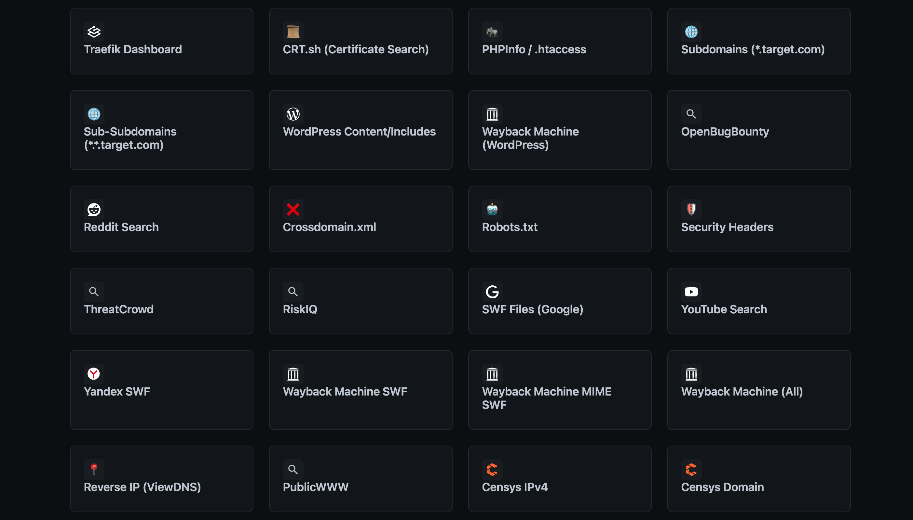

# Reconal 🎯

**Reconal** is a powerful, zero-dependency OSINT reconnaissance tool. It automates over 70+ Google Dorks and advanced search queries to help finding Bug Bounties and security vulnerabilities.

  

## ✨ Features

-   **Zero Dependencies**: Runs on standard Python 3 libraries. No `pip install` needed.
-   **Modern Web Dashboard**: Dark-themed, responsive UI.
-   **70+ Recon Modules**:
    -   ☁️ **Cloud**: AWS S3, Azure Blob, Google Storage.
    -   🔌 **API**: Swagger, GraphQL, WSDL.
    -   🔓 **Leaks**: .env files, Pastebin, Trello, Source Maps.
    -   🛠 **DevOps**: Jenkins, Travis CI, .git folders.
-   **Cross-Platform**: Works on macOS, Linux, and Windows.

## 📸 Screenshots

### Web Dashboard


### Modules




### CLI Support


## 🚀 Quick Start

### 1. Web Dashboard (Recommended)
This launches the professional GUI in your browser.
```bash
python3 reconal_web.py
```
Open `http://localhost:8080` (or the port shown in terminal).

### 2. CLI Mode
For terminal users:
```bash
python3 reconal_cli.py -t example.com --list
```

## 🛠 Usage
1.  **Enter Target**: Type the domain you want to investigate (e.g., `uber.com`).
2.  **Select Module**: Click on a card (e.g., "Directory Listing", "S3 Buckets").
3.  **Analyze**: A new tab opens with the specific search query executed.

## 📦 Installation
Just clone the repo and run.
```bash
git clone https://github.com/mohmmedalariki/Reconal.git
cd Reconal
python3 reconal_web.py
```

## 🛡 Disclaimer
This tool is for educational and ethical testing purposes only. Usage for attacking targets without prior mutual consent is illegal. 
