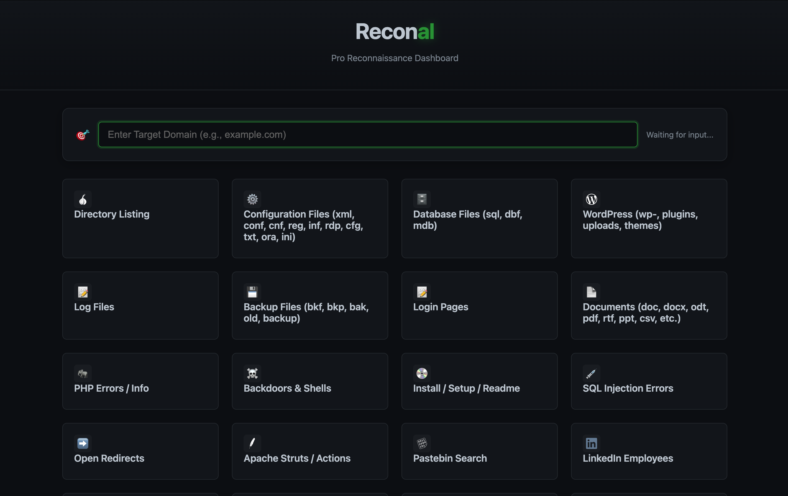
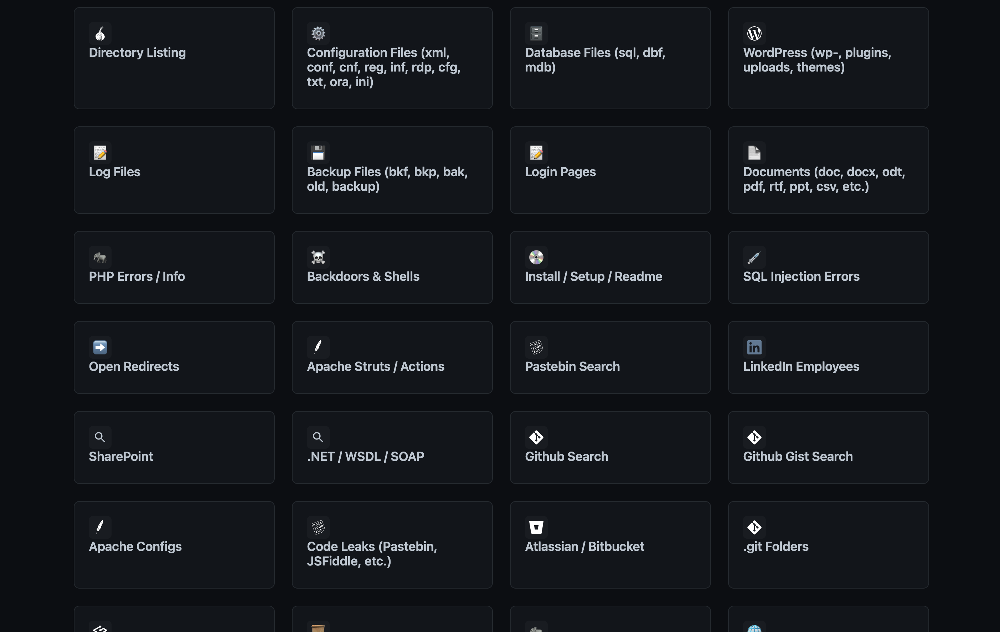

# Reconal 🎯
> **Advanced OSINT Reconnaissance Framework**
> *Automate 70+ google dorks and detailed infrastructure analysis from a single native dashboard.*

  

Reconal transforms tedious manual dorking into a streamlined workflow. Originally a command-line script, it is now a fully native desktop application that bridges Python's raw power with a modern, responsive interface. No web servers, no localhost exposure—just a standalone executable.

---

## ⚡ Features

*   **Native Desktop Experience**: Zero-config standalone app (`.exe` / `.app`). No Python environment required for end-users.
*   **70+ Recon Modules**:
    *   **Cloud Recon**: S3 Buckets, Azure Blobs, DigitalOcean Spaces.
    *   **Infrastructure**: Config files (`.env`, `.git`), Jenkins, Traefik, Logs.
    *   **API Discovery**: Swagger UI, GraphQL, WSDL, Postman collections.
*   **Secure Architecture**: Runs in an isolated WebView. No external ports opened.
*   **Legacy CLI**: Includes a robust command-line interface for terminal workflows.

---

## 📸 Interface

| **Dashboard** | **Module Selection** |
|:---:|:---:|
|  |  |

---

## 🚀 Installation

### Option A: Pre-built Binaries (Recommended)
Download the latest stable release for your platform:
*   **Windows**: [`Reconal.exe`](https://github.com/mohmmedalariki/Reconal/releases/latest)
*   **macOS**: [`Reconal_Installer.dmg`](https://github.com/mohmmedalariki/Reconal/releases/latest)
*   **Linux**: [`Reconal_Linux`](https://github.com/mohmmedalariki/Reconal/releases/latest)

### Option B: Build from Source
If you are a developer or want to modify the core engine:

```bash
# 1. Clone & Install
git clone https://github.com/mohmmedalariki/Reconal.git
cd Reconal
pip install -e .

# 2. Run Locally
python -m reconal.app
```

> **Build Your Own:**
> *   [Building for Windows](docs/build_windows.md)
> *   [Building for macOS](docs/build_macos.md)
> *   [Building for Linux](docs/build_linux.md)

---

## 🛠 CLI Usage
Prefer the terminal? The engine is available directly:

```bash
# Scan a target
reconal-cli -t example.com --list

# Launch specific module (e.g., #4)
reconal-cli -t example.com -i 4
```

---

## 📜 Legal & Disclaimer
**Reconal is for educational and authorized security testing purposes only.**
Usage of this tool for attacking targets without prior mutual consent is illegal. The developers assume no liability and are not responsible for any misuse or damage caused by this program.

---
*Maintained by [Mohmmed Alariki](https://github.com/mohmmedalariki)*
